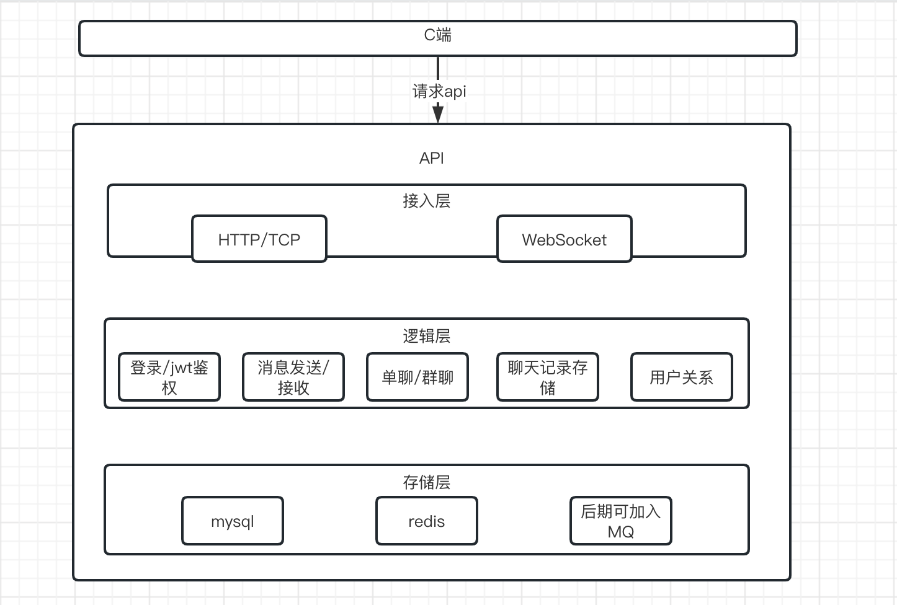
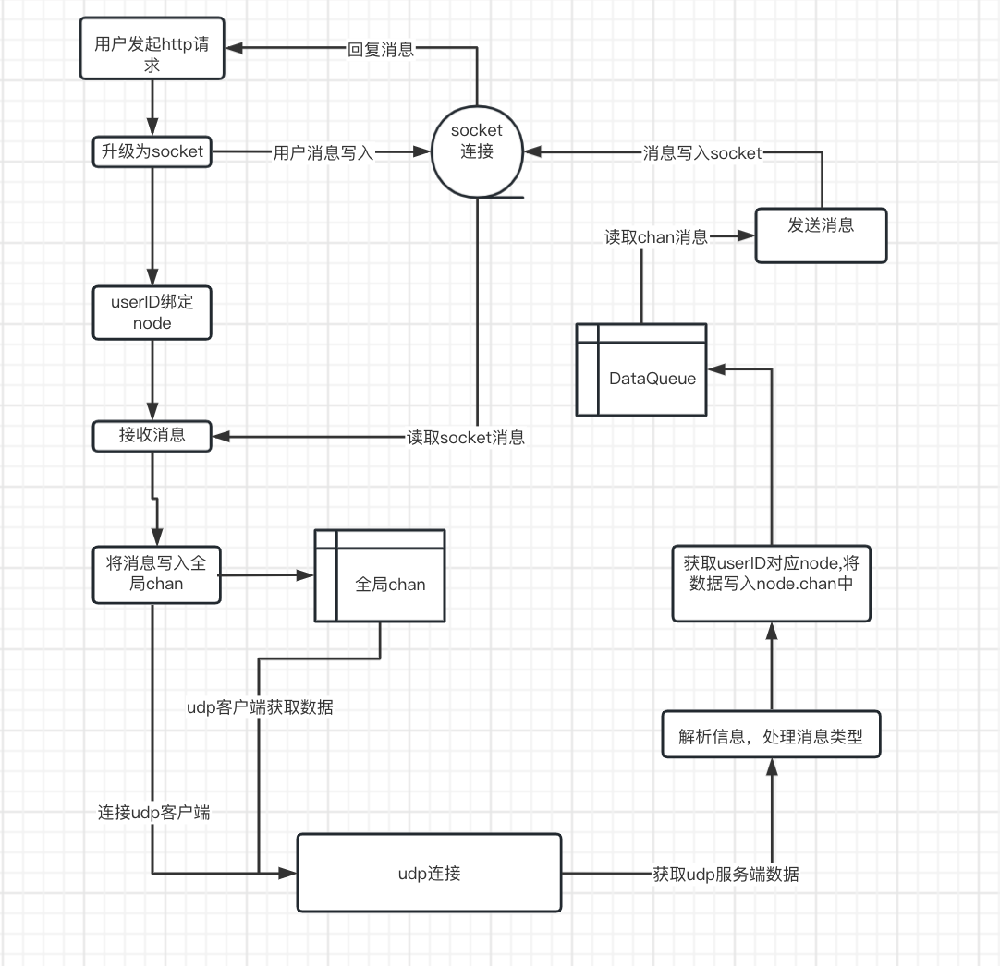
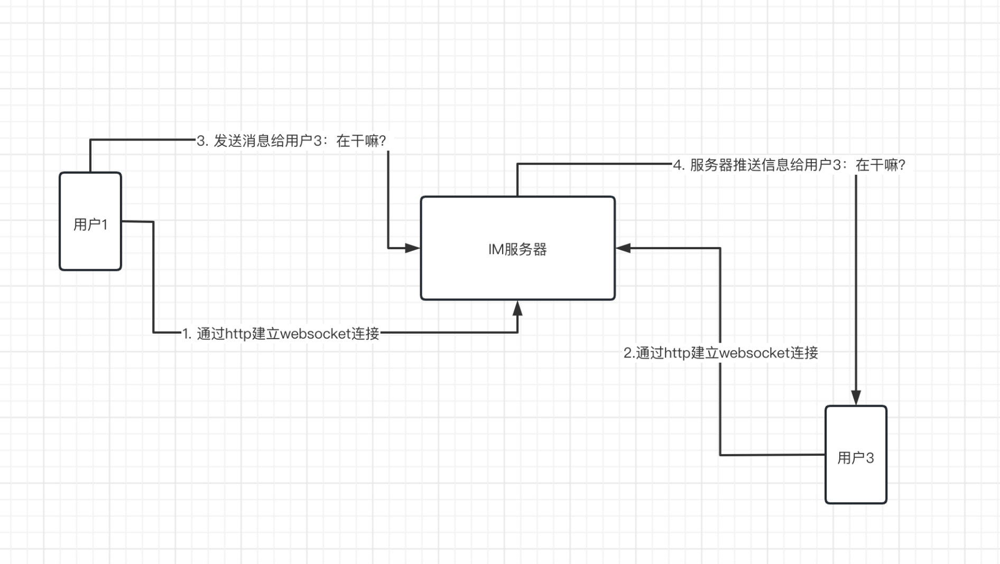
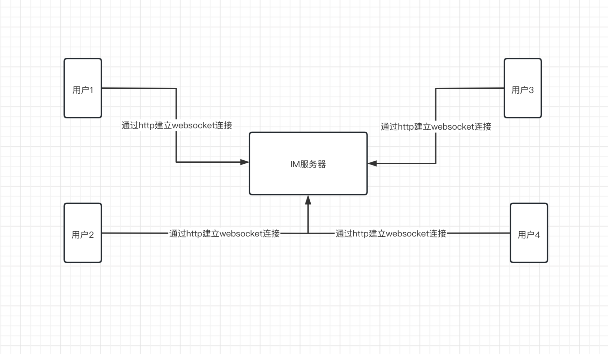

## IM 項目 (使用websocket)

#### 參考：[从0到1搭建一个IM项目](https://learnku.com/articles/74274)

### 主要功能
* 登入、註冊、用戶資料更新、帳號註銷
* 單聊、群聊
* 加好友、好友列表、建群組、加入群組、群組列表

### 技术 Tool
* Go、Gin、Websocket、UDP、Mysql、Redis、Viper、Gorm、Zap、Md5、Jwt

### 系统架构

### 通信流程

